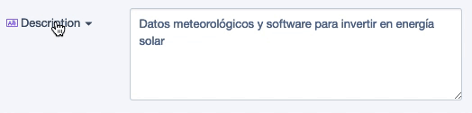
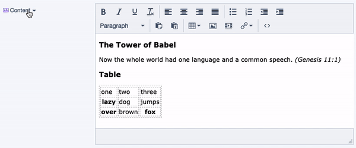

# Autotranslate

This module integrates Silverstripe CMS with Google Translate API and then allows content editors to use automatic translation for every translatable field.

Plain text field:

WYSIWYG field:

## Dependency

https://github.com/tractorcow-farm/silverstripe-fluent

## Instalation
* Add composer package

`composer require bratiask/silverstripe-autotranslate`
* Run dev/build?flush=all

`vendor/bin/sake dev/build?flush=all`

* Set Google Translate API key (CMS → Settings → Autotranslate)